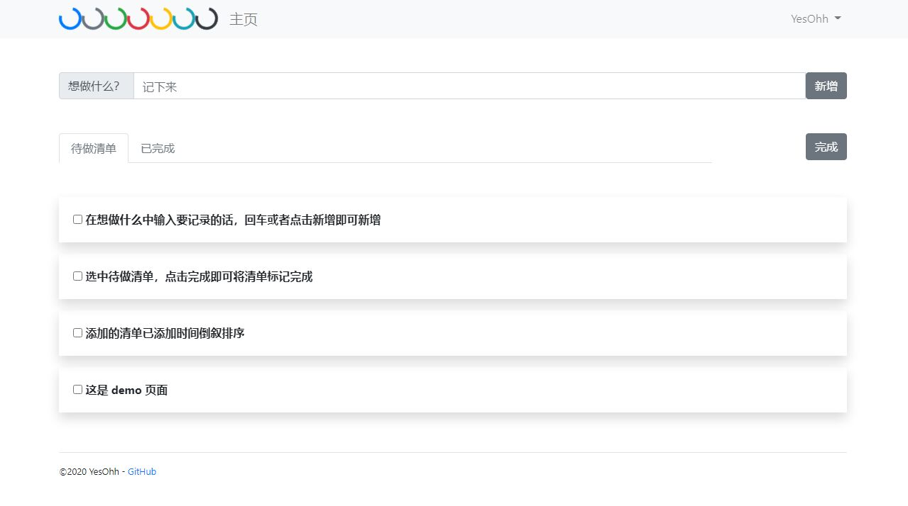

GoToDo 待做清单
=
使用 golang 编写的待做清单。

## 使用须知
* 配置 conf.toml

    * 运行的 ip 和端口，默认运行在 127.0.0.1:8080
    * 日志存放的文件夹地址

* 运行

    * 安装 go 并配置好环境变量
    * go run main.go
    > 因为墙的原因，可能无法更新 go mod，可以配置使用国内镜像源  
    > 配置方式见 https://goproxy.cn  

* 支持功能

    * [x] 添加待做清单
    * [x] 查看历史完成
    * [ ] 允许待做清单事项提醒（邮件、钉钉等）
    
* demo

    