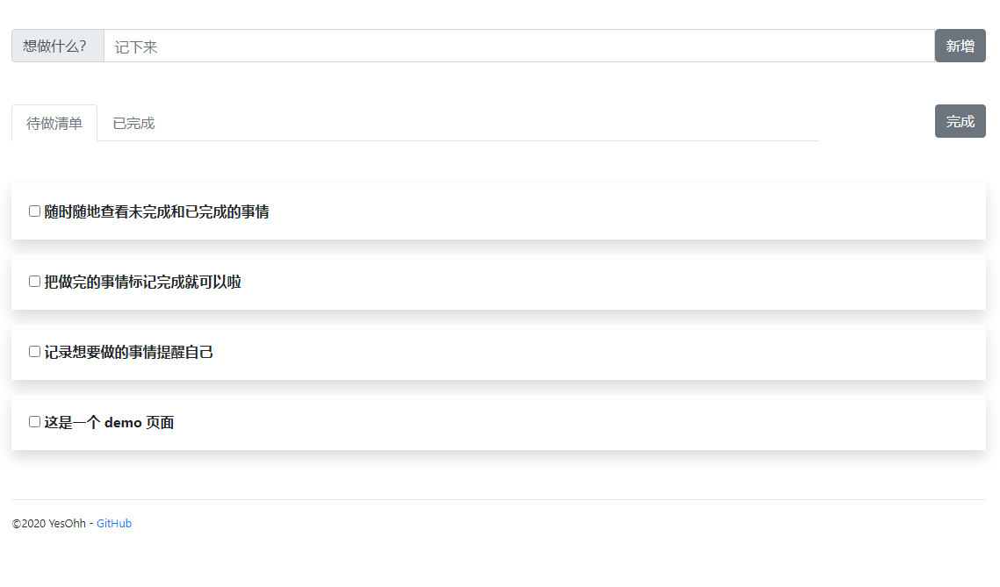
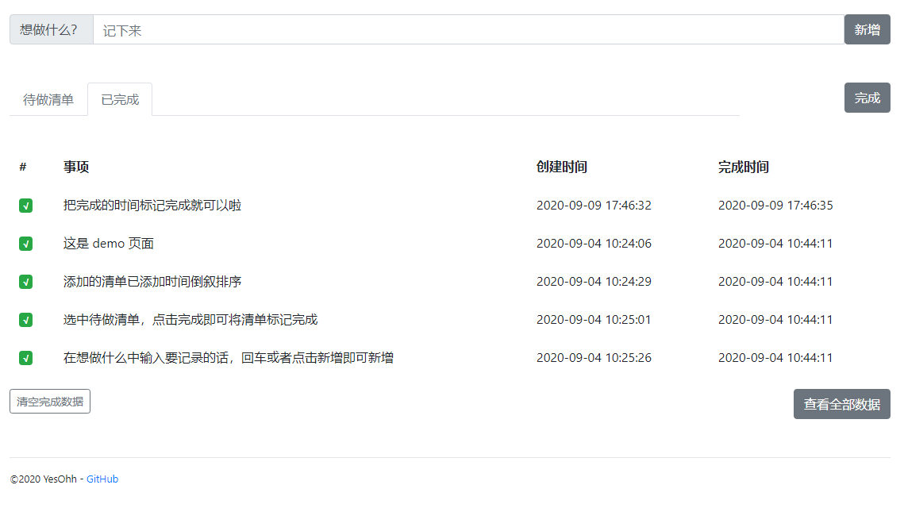

GoToDo 待做清单
=
使用 golang 编写的待做清单。  
项目运行地址: https://listspad.xyz

## 使用须知
* 配置 conf.toml

    * 运行的 ip 和端口，默认运行在 127.0.0.1:8080
    * 日志存放的文件夹地址
    * redis 设置

        * 是否启用 redis（启用后可使用待做事项提醒功能，默认不启用）  
        > 如需启用，需要配置 redis 的订阅功能，在 redis.conf 中配置 ```notify-keyspace-events "EKx"```  
        
        * ip：默认运行在 localhost
        * port：默认运行在 6379
        * 密码：默认为空
        * 数据库: 默认选择0号

* 运行

    * 安装 go 并配置好环境变量
    * go run main.go
    > 因为墙的原因，可能无法更新 go mod，可以配置使用国内镜像源  
    > 配置方式见 https://goproxy.cn  

* 支持功能

    * [x] 添加待做清单
    * [x] 查看历史完成
    * [x] 允许待做清单事项通过钉钉提醒

    > 开启 redis，配置订阅  
    > 用户配置钉钉机器人，设置自定义关键词为"待办提醒"，将机器人与自身账号拉到同一个群中  
    > 配置方式见 https://ding-doc.dingtalk.com/doc#/serverapi2/qf2nxq
    
* 具体使用

    * 用户注册、登录以及登出
    * 待办事项添加以及查看
    * 已完成事项查看以及清除
    * 指定时间推送指定消息至钉钉，此功能需要配置 redis 以及设置钉钉，钉钉机器人的 webhook 在登录后用户设置中可添加或修改

* demo

    
    
    
